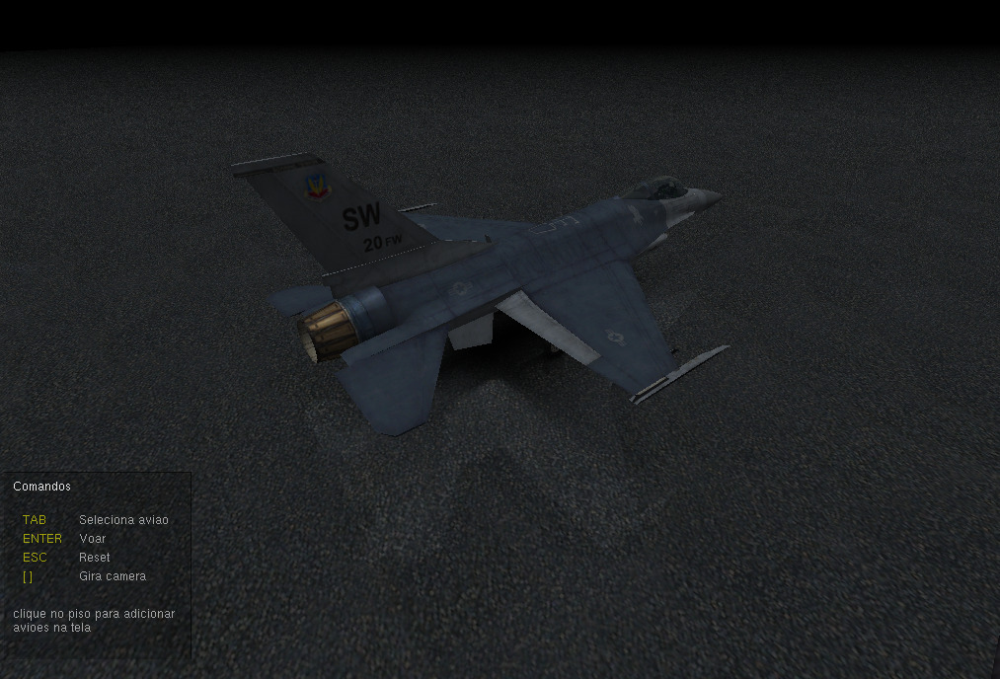
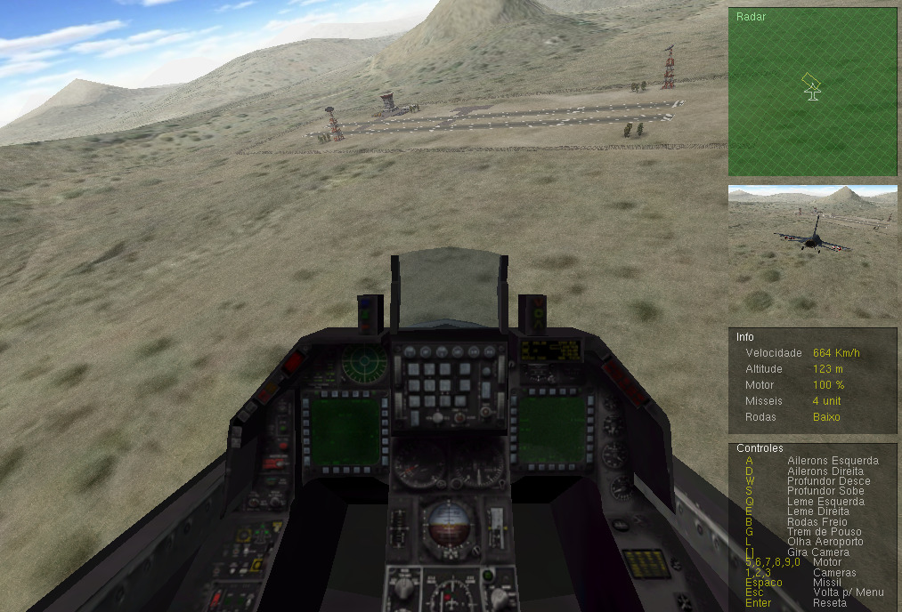
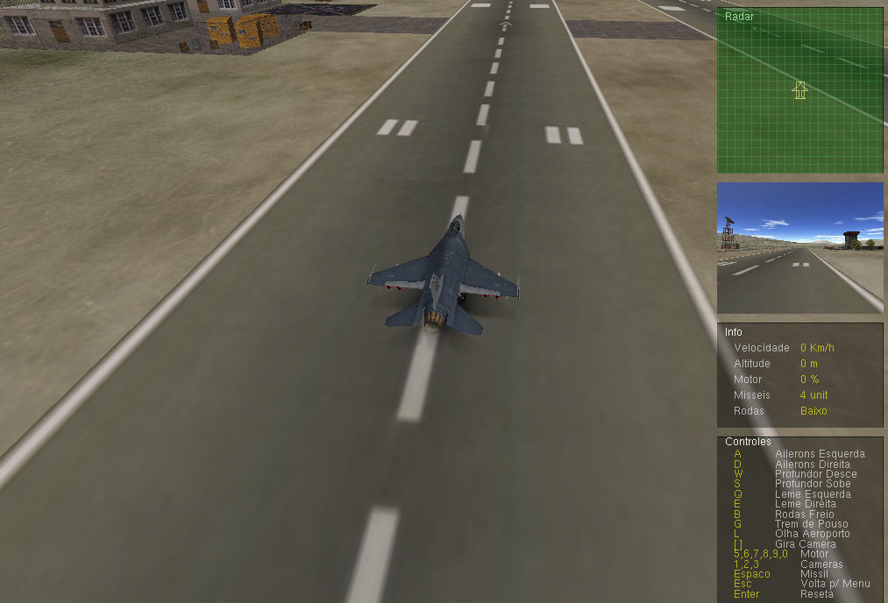

# Projeto de exemplo de um mini game de aviao feito em opengl

Projeto de um mini game de avião feito em c++, openGl e glut, 
como um trabalho de computação gráfica para o curso de Ciência da computação da Fucauldade Federal de Viçosa

- biblitecas necessárias: freeglut3: 
    sudo apt-get install freeglut3-dev

